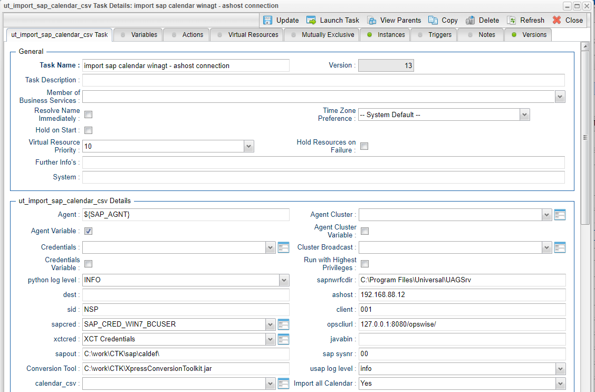
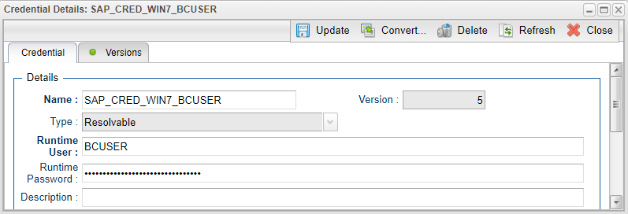
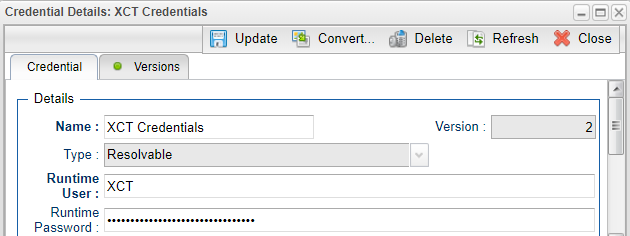
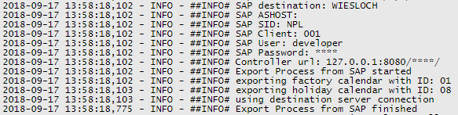
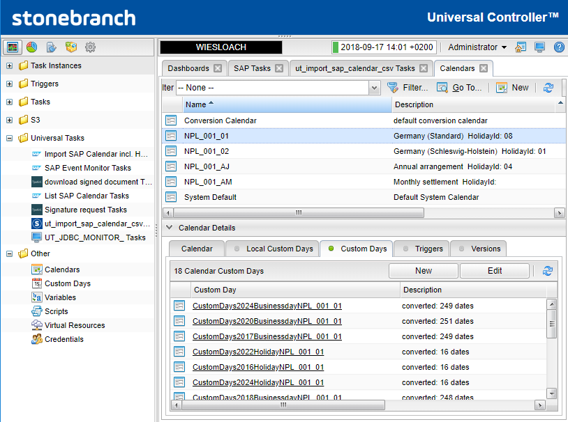
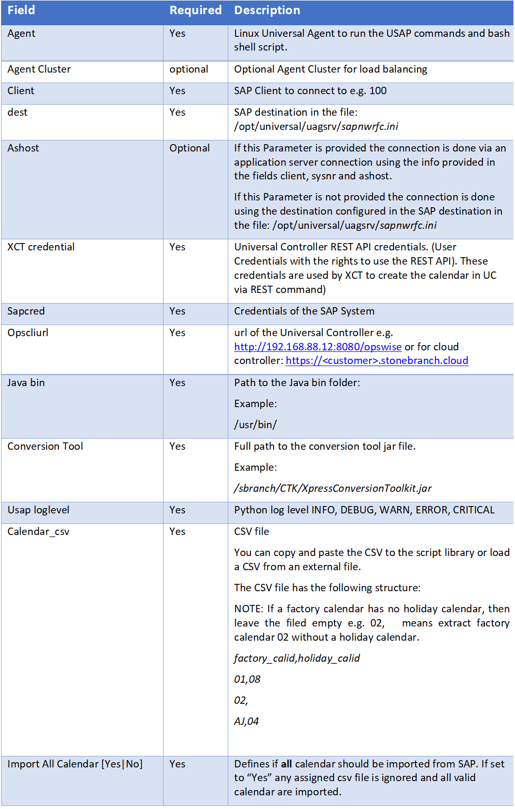
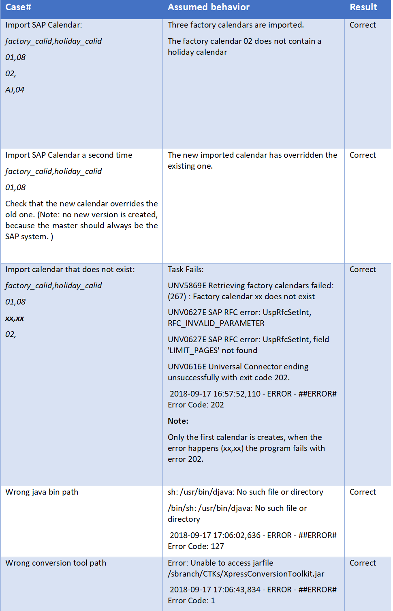
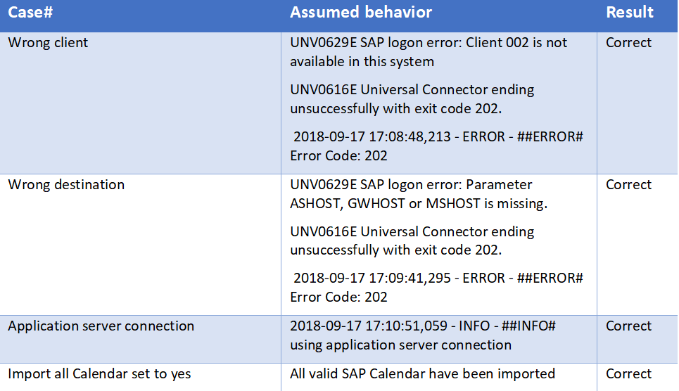

# ut-sap-import-calendar-csv-windows
The following Universal Task allows to mass import SAP calendar into Universal Automation Center. The task is useful for any customer scheduling SAP with our Controller. It will allow to schedule SAP task without the need of regular manual lookups of the calendar in SAP.

# Abstract: 

This Universal Tasks allows to import the SAP Factory Calendar and the related Holiday Calendar into the Universal Controller. You can either import a user defined list of SAP calendar or all valid SAP calendar.

# 1	Disclaimer

No support and no warranty are provided by Stonebranch GmbH for this document and the related Universal Task. The use of this document 
and the related Universal Task is on your own risk.

Before using this task in a production system, please perform extensive testing.

Stonebranch GmbH assumes no liability for damage caused by the performance of the Universal Tasks

# 2	Scope 
This document provides a documentation how to install and use the Universal Tasks for SAP Calendar Import.  

# 3	Introduction

This Universal Tasks allows to import the SAP Factory Calendar and the related Holiday Calendar into the Universal Controller. You can 
either import a user defined list of SAP calendar using a csv file or all valid SAP calendar.

Some details about the universal task to import SAP calendar:
-	The Universal Task imports either a user defined csv-list or all SAP Factory- and related Holiday Calendar into the Universal Controller.
-	The csv list is saved incl. Versioning into the Universal Controller script library
-	The Universal task is based on python. It runs on Linux as well as Windows agents
-	The required Python language can be installed during the Universal Agent upgrade or new install
-	The calendar export is done using the SAP certified XBP-RFC interface
-	The calendar import to Universal Controller is using the Stonebranch Express Conversion Tool kit “XCT”.
-	SAP is always considered as the Master, meaning Calendars are always export from SAP, never import to SAP.
-	All Calendar functionalities are support incl. Factory, Holiday and “Special Rules” 
-	You can set different log-levels for the Universal task, providing you more information in case of issues

# 4	Installation

# 4.1	Requirements for Linux Agent

Universal Template name: ut-sap-import-calendar-csv-linux

**Related UAC XML Files for template and task:** Github repository
**Software used:** 
-	Python 3.6 – can be installed as part of the Universal Agent
-	For Python the following modules are required: 
        -	os, for linux command execution
        -	datetime and time to compare file timestamps
        -	logging, for python loglevel support
        -	csv, to handle csv files
        -	subprocess to execute os commands
        **Note: None of the modules needs to be added via python installer as they all belong to the standard python modules** 
-	Universal Controller V6.4.7.0 or higher
-   Universal Agent V6.5.0.0 or higher installed on a Linux Server or Windows Server
-   Stonebranch Express Conversion Toolkit XCT 6449 ( will be provided on request by Stonebranch)

 

# 4.2	Installation Steps

**4.2.1	Installation Steps Windows**

The following describes the installation steps for Windows. A similar installation 
**1.	Unzip the file CTK.zip to folder on your Windows Server accessible by Universal Agent**

**Result:**
  
Double click on the XpressConversionToolkit and enter the license key located in the text file: license_sap_ctk

**Description:**
•	XpressConversionToolkit: This Toolkit is used to read the exported SAP Calendar files and import them to Universal Controller
•	Import_files: contain the Universal Task XML file, which need to be imported to the 
•	license_sap_ctk: license key for the XpressConversionToolkit
•	sample: contains a sample csv file

**2.	Check the current Python Version**

python -V  (Note: Captial “V”)
If your Version is Python 3.6 or later all is fine. If no python or a lower Version has been installed upgrade your python Version or 
install the Universal Agent with the Python binding option (--python yes). This option will install python 3.6. along with your 
universal agent.

e.g.

sudo sh ./unvinst --network_provider oms --oms_servers 7878@192.168.88.12 --oms_port 7878 --oms_autostart no --ac_netname OPSAUTOCONF --
opscli yes --python yes

**3.	Add the required python modules**

It is assumed that the modules csv, logging, sys, datetime are already available. If not install them via pip. 
In a command shell run as sudo or root:
(Example install module csv)
pip install csv 
or in case of universal Agent with python binding: 
C:”\Program Files\Universal\Python36\python.exe" -m pip install csv

**4.	Import the Universal Task including the Universal Template to your Controller**

Go to “All Tasks” and load via the Import functionality the Universal Task configuration into the Controller. 

# 5	Universal Task Configuration

**1.	Activate: Resolvable Credentials in Universal Automation Center properties:**

**2.	Fill Out the Universal Task for SAP Calendar Import:**

**SAP Credentials** 

**Express Conversion Tool Credentials XCT:**

**3.	Create the CVS file to import SAP Calendar if not all calendar should be imported**

You can copy and paste the CSV to the script library or load a CSV from an external file.

The CSV file has the following structure:

NOTE: If a factory calendar has no holiday calendar, then leave the filed empty e.g. 02,   means extract factory calendar 02 without a 
holiday calendar.

factory_calid,holiday_calid
01,08
02,
AJ,04
Example:

**Task Output**

**Result in Universal Controller:**

After the import the calendar are imported in the Universal Controller.
Example: NPL_001_01
Means Factory Calendar 01 has been imported from SAP SID: NPL Client 001
The imported Calendar consists of CustomDays List of Type workday and holiday.

**Description**

# 6	Test Cases

The following basic test cases has been performed:

 

 

# 7	Document References

There are no document references.

